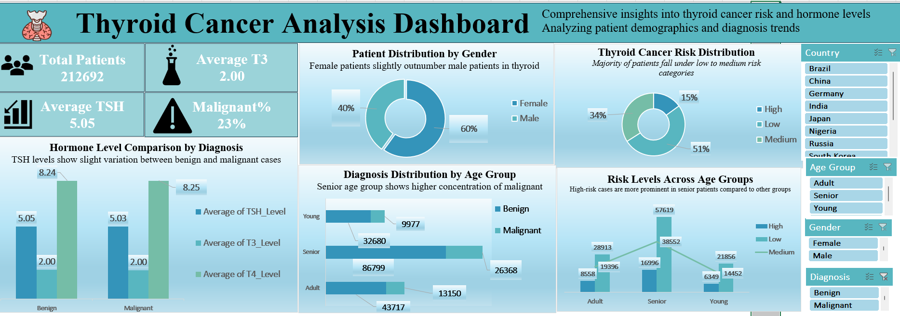

# 🧠 Thyroid Cancer Analysis Dashboard (Excel)

## 📌 Project Overview
This project presents an interactive **Thyroid Cancer Analysis Dashboard** built using Microsoft Excel.

The dashboard provides insights into patient demographics, hormone levels, diagnosis distribution, and cancer risk categories through visually appealing charts and KPI cards.

---

## 📊 Dashboard Preview

  

---

## 🎯 Objectives
- Analyze thyroid cancer patient data  
- Identify risk distribution across age groups and gender  
- Compare hormone levels (TSH, T3, T4)  
- Generate data-driven healthcare insights  

---

## 📈 Key Insights
- Female patients slightly outnumber male patients  
- Majority of patients fall under low to medium risk categories  
- Senior age group shows higher malignant cases  
- Hormone levels vary across diagnosis types  
- High-risk cases are more prominent in senior patients  

---

## 🛠️ Tools Used
- Microsoft Excel  
- Pivot Tables  
- Charts & Data Visualization  
- Slicers (Interactive Filters)  

---

## 💡 Skills Demonstrated
- Dashboard Design  
- Data Analysis  
- Data Visualization  
- KPI Tracking  
- Business Insight Generation  

---

## 📁 Project Structure
